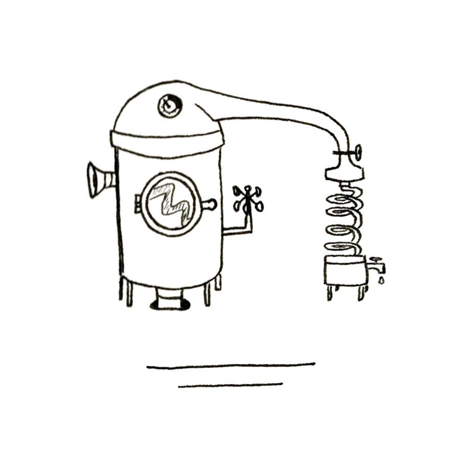

(réparation)

--- KHEIRA !

--- Hein ? Pourquoi criez-vous comme ça, mon oncle ? Vous m’avez fait peur ! J’ai failli faire tomber la pièce maîtresse de mon mécanisme.

--- Si tu avais répondu à mes premiers appels, je n’aurais peut-être pas eu besoin de hausser le ton. Tout le monde te cherche, Kheira, et me demande où tu es. J’aurais dû me douter que tu étais dans ton atelier plutôt que d’aller fouiller les moindres recoins de la maison. Qu’est-ce que tu fabriques ?

--- Je ne peux pas encore vous le dire, je ne suis pas totalement sûre de son fonctionnement. D’ici un jour ou deux, je pense, je pourrai vous dévoiler ma nouvelle machine. Mais qui me cherche ? Et pourquoi ?

--- Tu sais que notre grande fête d’automne est dans quelques jours et qu’elle ne va pas se préparer toute seule. Les Chefs sont en train de répartir les rôles entre les villageois, ça serait la moindre des choses que tu sois présente.

--- Oui, oui, je vais arriver. Je ne savais pas que la Grande organisation des Brumades d’Arhane avait déjà débuté, désolée.

--- Bon, il faut que je file. Un des ouvriers de la Machine a voulu fanfaronner devant sa petite amie et il est sorti du village pour lui rapporter une branche de l’Extérieur.

--- Mais il est fou ! Il va bien ? Et la branche, qu’en avez-vous fait ?

--- Je l’ai confiée au Gardien de la Muraille pour qu’il la détruise. Il ne faudrait pas qu’elle nous contamine. Et puisque tu le demandes, l’inconscient qui a pris ces risques inconsidérés va bien. Le Charlatan l’a examiné. Il n’a rien trouvé de suspect sur sa peau et a pu s’assurer qu’il respire sans problème. Par contre, il est bon pour la prison. Je me demande si je ne vais pas le boucler plus longtemps que la journée réglementaire. Il a un sérieux besoin d’être rappelé à l’ordre. Il faut que j’y aille, je dois procéder à son incarcération.

Restée seule, Kheira se replonge dans l’assemblage des mécanismes compliqués sur lesquels elle travaille. Sa pensée vagabonde quand soudain, elle se souvient qu’on l’attend pour préparer les Brumades. La jeune fille pose alors ses outils d’orfèvre, sort de l’atelier et court se changer rapidement dans sa petite chambre, deuxième pièce de la maisonnette qu’elle partage avec son parent. Kheira enfile une jupe par-dessus des pantalons, essaie de renouer ses boucles rebelles et sort de la maison sans un regard pour son reflet dans le miroir cloué à l’entrée. Elle y aurait vu les traces noires du lubrifiant qu’elle utilise pour ses travaux, étalées sur les quelques taches de rousseur qui parsèment ses paupières inférieures. Ce genre de détail lui importe peu, tout comme l’effet que ses yeux verts et perçants peuvent provoquer chez les autres, qui ont bien souvent du mal à s’en détacher.

Arrivée sur la place centrale du village, Kheira perçoit l’effervescence provoquée, comme chaque année, par l’organisation des Brumades. Chacun y va de son idée nouvelle pour les épreuves sportives et artistiques. C’est un brouhaha sans nom que les Chefs ont bien du mal à percer de leurs préconisations. Kheira, au cœur de ce capharnaüm, se demande comment son absence a pu être remarquée. Jusqu’à ce qu’une femme, l’apercevant, crie :

--- Ça y est, elle est là ! Kheira est arrivée !

--- Très bien, nous sommes tous présents, nous allons pouvoir commencer.

Comme par enchantement, le silence s’est imposé. Dans ce village de quelque cent habitants, tout le monde connaît tout un chacun ce qui rend impossible la plus infime possibilité d’échapper aux rassemblements généraux, sauf à avoir une excuse imparable, comme un empêchement pour cause d’emprisonnement ! Kheira le savait, mais ne l’avait jamais expérimenté. Voilà chose faite.

--- Bien. Nous avons fait le bilan des festivités de l’an passé et en avons tiré les conclusions qui s’imposaient. Je vous rappelle que la nourriture est précieuse. Sans les Arcanis, cette fête ne vaudrait rien et je ne supporterais pas de voir le moindre gaspillage. Ce que vous ne mangez pas, conservez-le pour les victuailles du lendemain. Vous terminerez ce que vous aviez entamé la veille avant de vous resservir. Pensez à prendre des calebasses dans lesquelles vous garderez les aliments qui vous ont été trop servis. Rappel important concernant les jeux : il est interdit de se défier à qui lancera sa pierre au-dessus de la Muraille. Souvenez-vous qu’il y a déjà eu des accidents ! D’autre part...

--- Kheira !

En entendant appeler son nom, la jeune fille réalise qu’elle a cessé depuis un moment d’écouter le discours du Chef organisateur. Il faut dire que chaque année c’est la même rengaine, les mêmes mises en garde. C’est à croire que les habitants du village sont amnésiques. Pourquoi faut-il toujours leur rappeler des choses qu’ils savent déjà ?

--- Kheira, tu avais prévu de proposer une animation cette année ? En quoi consiste-t-elle ?

L’inventrice en herbe expose son idée. Elle a imaginé un mécanisme qui permet d’ouvrir automatiquement une porte fermée à clé. Le concurrent qui veut le défier dispose du temps d’un long sablier pour débloquer ce mécanisme, sans le casser, bien sûr, ni en ôter aucune pièce. S’il y parvient, il a gagné sinon, la porte s’ouvrira d’elle-même, le temps imparti écoulé.

--- Et qu’est-ce qu’on gagne ?

C’est Mizho, bien sûr, qui pose la question. Kheira a bien une petite idée de ce que son camarade de jeu de toujours aimerait bien gagner, mais il peut toujours y compter !

--- Je ne sais pas. Il faut voir ça avec les organisateurs.

Le garçon lui fait un grand sourire. Ce qui intéresse Mizho, c’est la machine sur laquelle travaille son amie, qui l’a mis dans le secret. Kheira est en train de fabriquer une horloge qui fonctionne en tous points à l’inverse d’une horloge classique. Elle l’a montée pièce par pièce et, suivant la logique du temps, cette horloge, en décomptant les heures, devrait permettre à son utilisateur de remonter dans le temps, tout en restant à l’endroit où il était quand il a mis l’horloge en marche. Kheira l’a testée et l’horloge lui a permis de remonter cinq minutes plus tôt. La scène qu’elle venait de vivre s’est reproduite à l’identique. Elle a de nouveau entendu l’enfant qui criait dans le chemin devant chez elle, sermonné par son père et vu l’oiseau posé sur le rebord de sa fenêtre prendre son envol, dérangé par le bruit. Sous le coup de l’émotion, l’inventrice s’était affaissée sur une chaise qui, par chance, se trouvait là. Il reste cependant un problème de taille à régler. Le remontoir ne permet pas encore à l’horloge de remonter le temps au-delà de cinq minutes. La jeune fille y travaille depuis des jours et ne désespère pas de trouver rapidement une solution.

Une fois que la Grande organisation est bien calée, chacun peut retourner à ses préoccupations. La vie du village est réglée de façon immuable. Chacun participe à la vie communautaire en tirant l’eau du puits, en nettoyant et désherbant les communs. Quelques habitants ont des métiers bien identifiés comme l’oncle de Kheira, Administrateur de la prison, le Maire, les six ouvriers Gardiens de la Machine, le Charlatan, qui soigne les rares malades, le Gardien de la Muraille et les cinq Chefs garant de la vie col lective, qu’ils gèrent de façon collégiale. La nourriture n’étant pas un problème, personne n’a besoin de s’y consacrer. Les villageois tissent eux-mêmes le tissu de leurs vêtements avant de l’assembler en des tenues rudimentaires. La vie s’écoule paisiblement au village. Les hauts murs qui le ceignent lui assurent la tranquillité. À l’Extérieur, ce n’est que chaos et horreur. L’air y est irrespirable, des créatures monstrueuses font régner la terreur. Malheur à celui qui s’y aventure ! Sur le chemin qui la ramène chez elle, Kheira repense à l’imprudent qui a osé franchir les Portes de la Muraille. À la branche qu’il a rapportée. Poussée par la curiosité, elle fait un détour par la cahute du Gardien qui lui dit qu’il a déposé l’objet maléfique chez le Charlatan, ne sachant qu’en faire. Elle retrouve ce dernier sur le pas de porte de son cabinet, qui contemple le va-et-vient des villageois affairés par les menus travaux du quotidien.

--- Bonjour, Charlatan, comment allez-vous ?

--- Bonjour, Kheira, quel souci t’amène ?

--- Aucun, Charlatan. J’aurais juste aimé voir la branche qui a été rapportée de l’Extérieur.

--- Comment oses-tu, malheureuse ? Tu veux goûter de la prison et de la rééducation pour éloigner ces pensées dangereuses ?

--- Mais comment des pensées peuvent-elles être dangereuses ? J’étais juste curieuse de voir cette branche pour savoir si ses maléfices la rendent différente de celles de nos arbres au village ! Je ne voulais pas vous offenser !

--- De toute façon, je l’ai brûlée. Tu ne la verras pas.

--- Vous l’avez brûlée ? Mais vous ne risquiez pas de respirer des effluves nocifs ?

--- Non ! J’ai fait attention ! Et puis laisse-moi avec tes questions ! Tu dois bien avoir des choses à faire pour préparer les Brumades ! Allez, laisse-moi. J’ai du travail.

Kheira tourne les talons sans un mot et reprend le chemin de sa maison, encore plus songeuse. Elle ne comprend pas la colère du Charlatan. Depuis toujours, elle sait que l’Extérieur est hostile, que ce sont les hauts murs et la Machine qui purifie l’air qui protègent le village de ses dangers. Pour rien au monde, elle ne se risquerait à franchir les portes de l’enceinte. Les Portes servent uniquement à faire entrer les Arcanis et les denrées qu’ils apportent régulièrement aux villageois. Les anciens ont de vagues souvenirs d’un temps où le village n’était pas clos, où la Machine n’existait pas. Quand ils en parlent, rarement, leur discours est très flou, comme si leur mémoire leur jouait des tours. Kheira a appris, comme tout le monde, que le village ne doit sa survie qu’aux Arcanis et à leur aide précieuse. Grâce à eux, la Machine leur procure de l’air pur et les villageois mangent à leur faim. Ce sont eux qui ont permis de résister aux avaries de l’Extérieur. Est-ce que ce savoir empêche toute curiosité ? Quel mal y a-t-il à comprendre le monde qui nous entoure ?

C’est encore toute tourneboulée que Kheira arrive chez elle. Elle y retrouve son oncle, qui a fini sa journée de travail. Bien qu’elle ne se sente pas très bien, elle n’a pas envie de lui raconter sa discussion avec le Charlatan. Elle sent intuitivement que son oncle ne la soutiendra pas et ne la réconfortera d’aucune manière. Elle attendra de voir Mizho pour pouvoir s’épancher et essayer de comprendre. La jeune fille se ressaisit, tâche de faire refluer ses émotions pour parler le plus naturellement possible à son oncle.

--- Alors le prisonnier, comment va-t-il ? Avez-vous réussi à lui faire entendre raison ?

--- Il est en bonne voie. Mais comme je l’avais envisagé, il restera deux jours en prison. Son attitude a vraiment été irresponsable et il a encore besoin de réfléchir. Ceci d’autant plus qu’il met la communauté en danger. Il est quand même censé surveiller la Machine ! Il a une mission importante dans ce village ! Mission qu’il a négligée en sortant, sachant qu’il risquait ensuite l’emprisonnement. Je ne suis pas sûr qu’il en soit digne. Il faudra que j’en réfère au Chef de la Machine. Qui va bien pouvoir le remplacer ?

--- Moi je sais !

--- Toi, du haut de tes 18 ans, tu sais ? Je t’écoute.

--- Mon oncle, vous connaissez mes capacités. Personne mieux que moi dans ce village qui compte nombre d’horlogers très appréciés, personne mieux que moi ne maîtrise aussi finement les mécanismes.

--- Je te vois venir, jeune fille ! Mais pour qui te prends-tu ? Tu crois vraiment pouvoir assumer de telles responsabilités ?

--- Mais, mon oncle, il suffit juste de surveiller la Machine à travers un hublot et de s’assurer qu’il n’y a aucun dysfonctionnement ! Non seulement je pourrais faire ça, mais je saurais même réparer les éventuelles pannes. En plus, il n’y en a jamais.

--- Quelle outrecuidance, il suffit ! Laisse les chefs faire leur travail et retourne à tes bricolages. J’ai entendu dire que tu travaillais à un mécanisme pour les Brumades. Je te rappelle que c’est dans moins de trois jours et que tu n’auras pas que ça à faire pour les préparatifs.

--- Oui, mon oncle, excusez-moi, j’y retourne.

Mortifiée pour la seconde fois de la journée, Kheira est trop heureuse de trouver refuge dans son atelier. La jeune fille fulmine. Il y a bien longtemps qu’il est terminé son déverrouillage automatique dont elle sait pertinemment qu’aucun villageois, si doué soit-il, ne se sortira ! Qu’est-ce qu’ils ont tous à la prendre pour une idiote ? À commencer par le Charlatan qui pensait qu’elle allait le croire. C’est sûr qu’il ne l’a pas brûlée la branche, sinon il y aurait eu des effets nocifs. À moins qu’elle ne soit pas dangereuse ? Et pourquoi le Gardien de la Machine est-il rentré sain et sauf ? Pourquoi ne l’a-t-on pas mis en quarantaine ? Il est resté plusieurs heures à l’Extérieur et revient indemne ? Pour se calmer, Kheira se replonge dans le fonctionnement de son horloge inversée. L’étude des pièces, des rouages, l’apaise peu à peu et elle retrouve la concentration nécessaire qui la conduira à la résolution de l’ultime difficulté qui nuit au bon fonctionnement de son mécanisme. Kheira place beaucoup d’espoirs dans cette horloge, qu’elle a d’abord imaginée pour remonter suffisamment dans le temps pour retrouver ses parents. C’est un sujet tabou dont son oncle, le frère de sa mère, ne veut pas parler. Le couple est mort dans un accident alors qu’elle n’avait pas trois ans. Son oncle était le seul parent qui lui restait et qui, de fait, l’a recueillie. C’est tout ce que sait Kheira et tout ce qu’elle saura. Il y a bien longtemps qu’elle ne questionne plus son oncle à leur sujet, qu’elle a compris qu’il ne lui en dirait pas plus, trop ému pour en parler. Même Mizho ne connaît pas la raison profonde qui se cache derrière cette horloge inversée. Il croit juste que c’est un défi un peu fou que s’est lancé son amie, qui compte parmi les meilleurs horlogers du village. Bien qu’absorbée par son travail, Kheira a les nerfs à fleur de peau et ne se laisse cette fois pas surprendre par son oncle quand il entre dans son atelier.

--- Ça avance ?

--- Non, je bloque un peu, mais je serai prête.

--- Tu viens manger ? La nuit est tombée. Il faut que nous nous couchions tôt pour être en forme pour les préparatifs et pour accueillir les Arcanis, qui arrivent après-demain matin. J’ai vu avec les Chefs, ils ont demandé à Orland de remplacer Rusty. Je peux te le dire, c’est lui qui était sorti. Orland connaît déjà la Machine. C’est lui qui va se charger de récupérer le Stynx.

Le Stynx est la substance que produit la Machine en purifiant l’air. Ce gaz liquide doit être manipulé avec beaucoup de précautions et stocké dans de gros récipients étanches, fabriqués dans un matériau inconnu des villageois. Ces conteneurs sont fournis par les Arcanis, qui viennent les récupérer à chacun de leur passage. La venue de ces êtres étranges doués de pouvoirs surnaturels est toujours une fête pour les villageois, qui voient arriver avec eux de la nourriture en abondance, que les Arcanis déposent avant de repartir avec le Stynx. Pour les Brumades, les choses se passent un peu différemment. Les Arcanis restent un peu pour assister aux festivités qu’ils honorent de leur présence. C’est l’occasion pour les villageois de leur montrer leur reconnaissance.

Kheira, comme tout un chacun, attend la fête avec impatience. Les questions qui la taraudent resteront en suspens, le temps des festivités.
