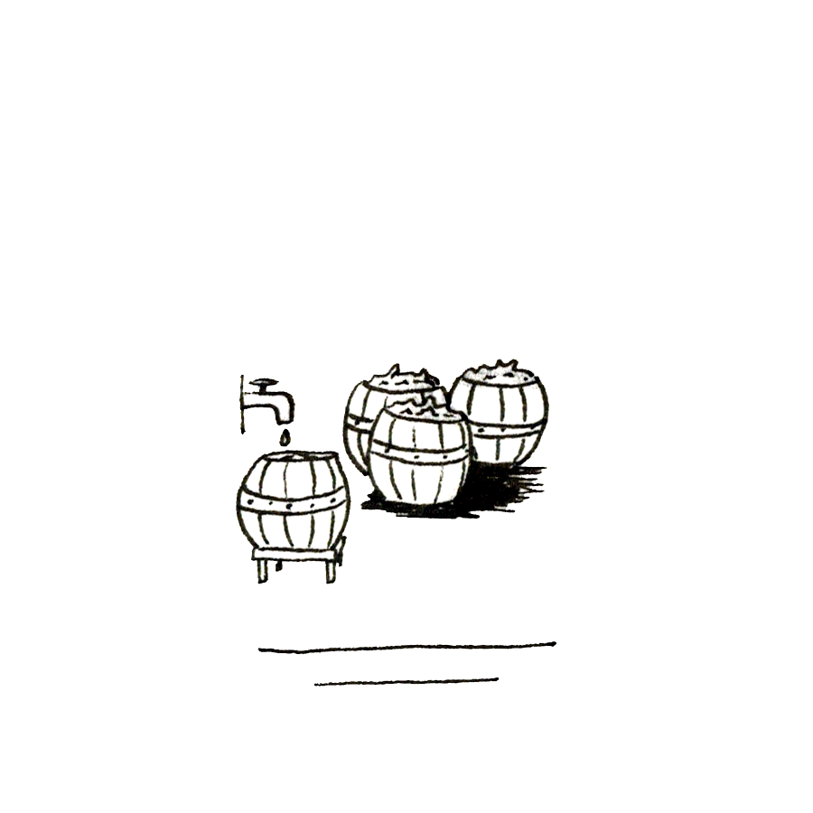

Tom ne marche pas aussi vite que d’habitude pour ne pas trébucher sur les nombreuses inégalités de terrain, cachées par les hautes herbes, de ce chemin de fortune longeant les marais. Il s’arrête fréquemment pour se retourner et vérifier que Kheira le suit toujours. Un peu plus jeune que lui, moins expérimentée dans ce genre de vagabondage hors des sentiers battus, elle parvient cependant à maintenir une allure identique à celle de son compagnon.

Celui-ci ne peut réfréner un sentiment de tendresse en la regardant porter son paquet de chiffon dans les bras comme si c’était un nouveau-né dans ses langes. Cette vision le fait sourire doucement.

-- Qu’y a-t-il ? lui lance-t-elle d’un ton agacé par ce regard qu’elle n’arrive pas à interpréter.

-- Rien ! Nous sommes presque arrivés.

-- Tu nous as fait passer par des sentiers que je ne connaissais pas.

-- C’est juste là ! Il reste ce pont à traverser et nous nous dirigeons droit vers la fumée blanche que tu vois, c’est celle de la forge.

-- Oui ! Je commence à m’y retrouver maintenant. Mais ne t’arrête pas tout le temps comme ça. Je serai plus tranquille une fois que nous serons arrivés chez toi. Avance !

Tom sourit intérieurement. Kheira a le don de le faire se sentir utile.

-- Je dois passer voir Héphaestos avant...

-- Tu ne peux pas aller le voir plus tard ? Il serait plus prudent de ne pas traîner avec ça ! lance la jeune fille en montrant son colis.

-- Ce sera rapide. Il m’a dit devoir s’absenter pour plusieurs jours et je me sens presque tout nu sans poignard.

-- Tout nu ! reprend Kheira en gloussant plus que riant. Vraiment ?

-- Ne te moque pas, répond Tom qui n’aime pas voir son amie s’aventurer sur ce terrain ambigu, car il s’y sait totalement impuissant face à la subtilité imparable des propos de la jeune fille.

-- Mais tu te sens, plutôt, sans chausses ou sans chemise ? Ou les deux ?

Et son rire chaud se fait à nouveau entendre. Elle aime bien le taquiner, le pousser, plus ou moins, dans ses derniers retranchements d’homme galant. Aujourd’hui cependant, elle préfère rester gentiment moqueuse, car elle sait très bien que son compagnon à casser son coutelas en voulant récupérer une bague qu’elle-même avait malencontreusement laissé tomber entre deux rochers. Le bijou avait été récupéré, mais pas la dague.

Tom préfère ne pas répondre, ne surtout pas entrer dans son jeu ; une autre fois, peut-être. Il se secoue et se relance sur le chemin du village, de sa maison, même si c’est un bien grand mot pour définir le gourbi qui lui sert d’abri, mais il le considère comme son chez-lui.

Pour se rendre chez le forgeron, ils contournent la place centrale au centre de laquelle se trouve le puits. Tom s’arrête soudain dans un coin d’ombre, derrière la porte bancale d’une ruine, où il attire Kheira d’une main ferme.

-- Tu veux me dire quelque chose ? demande-t-elle en murmurant, un large sourire aux lèvres.

-- Ne fais pas de bruit ! J’ai aperçu un cheval harnaché près de la forge et j’entends des voix, pas seulement celle d’Héphaestos. Il n’est pas seul.

À ces mots, la jeune fille se presse davantage dans l’ombre, tout contre son ami qui passe un bras autour de ses épaules dans un élan protecteur. Elle se retrouve collée tout contre lui, sentant son odeur de transpiration mêlée de cette senteur toute particulière qui ne le quitte jamais, celle du muguet, étrangement persistante, quelle que soit la saison.

Ils restent ainsi plusieurs minutes à écouter les bruits de voix, mais trop loin pour comprendre les mots échangés.

Le relatif silence du début de matinée est subitement rompu par un bruit de marteau, le bruit caractéristique du ferrage d’une monture.

-- Ce n’est sans doute qu’un paysan qui a amené son cheval au forgeron...

-- Pour le faire ferrer ! finit Tom d’un ton moqueur.

-- C’est vrai, tu as raison.

Kheira sait bien que seules les montures des nobles sont ferrées, car, utilisées trop rarement, enfermées en permanence dans des étables trop étroites, piétinant dans leurs excréments stagnants, la corne de leurs sabots s’affaiblit par l’action de l’ammonium. Les chevaux des paysans, continuellement sur les routes, dans les champs, bénéficient par contre de sabots entraînés, renforcés, capables de résister à l’usure provoquée par les surfaces rocheuses.

Dans certaines contrées, des seigneurs cupides commencent à laisser les gens du commun plagier cette habitude, vue comme un signe de raffinement, pour y créer des taxes de ferrage ; mais pas ici, pas encore.

-- Celui que j’ai vu à l’extérieur, poursuit Tom, n’était pas équipé comme un cheval de labour, crois-moi.

Le bruit de martèlement cesse aussi brutalement qu’il a commencé.

Les deux jeunes gens, toujours recroquevillés dans leur coin sombre, n’ont pas à attendre longtemps pour voir alors passer devant eux, deux cavaliers, vêtus d’une tunique orange et vert sur laquelle a été jetée une cape marron, arborant, le premier, un bonnet plat de laine rougeâtre, l’autre, une sorte de béret noir. À leur selle est attachée une épée à double tranchant. Certainement, des nobles d’une contrée voisine.

Une fois les deux inconnus disparus au loin, Tom se redresse et se dirige prudemment vers la forge, suivie par son amie.

-- Héphaestos ! lance-t-il, tu es là ?

-- Tom ! Tu t’es levé aux aurores, répond un grand homme, presque un géant, d’une quarantaine d’années, le crâne dégarni, portant un grand tablier de cuir.

-- Oui ! Mais apparemment, je ne suis pas le seul. J’ai vu s’éloigner deux cavaliers qui paraissaient venir d’ici.

-- L’une des montures avait perdu un fer. Ils ont eu de la chance de me trouver, je dois prendre la route avant midi.

-- Tu me l’avais dit. C’est pourquoi je passe ce matin.

-- Tu viens pour ta commande ; je l’ai terminée hier.

Le forgeron se dirige alors vers une caisse de laquelle il sort le fruit de son travail : un couteau d’une seule pièce, le mince manche torsadé formant une boucle élégante pour revenir vers le haut de la large lame.

-- Celui-ci, tu ne pourras que difficilement le briser, lui lance Héphaestos avec un coup d’œil malicieux à l’attention de Kheira, restée sur le pas de la porte ; elle lui avait raconté la mésaventure qui avait désarmé Tom.

-- Il est superbe.

-- Si tu veux, tu peux rajouter une lanière de cuir pour recouvrir le manche, et le rendre plus agréable à utiliser, surtout l’hiver.

-- Oui ! C’est une bonne idée.

-- Maintenant, je vais aller préparer mon paquetage pour ne pas partir trop tard.

-- Tu ne m’as pas dit combien je te dois.

-- Tom ! Tu sais bien comment ça marche entre nous : tu me rends des services et je t’en rends d’autres à mon tour. Tu connais ma devise : pas de monnaie, pas de taxe.

-- Merci beaucoup, Héphaestos. Bonne route, et fais attention à toi.

-- Toujours ! À bientôt vous deux.

-- À bientôt, lui répond Kheira.

Les deux jeunes compagnons font le tour de la forge pour se diriger vers la masure voisine dans laquelle ils pénètrent par la porte arrière, qui ne se laisse pas ouvrir par n’importe qui ; il faut bien la connaître pour y parvenir, l’entrée principale étant condamnée depuis longtemps.

Tom gravit rapidement les marches de l’échelle de meunier qui mène à l’étage, fermé par une trappe cadenassée. Après l’avoir déverrouillée, il se hisse sur le plancher et tend la main vers Kheira pour l’aider à le rejoindre.

Ils sont immédiatement accueillis par les jappements de Dapsy, un chien que l’occupant des lieux a recueilli alors que ce n’était encore qu’un chiot. Le jeune homme ne sait vraiment pas de quelle race il est ; comment parvenir à la définir avec tous ces bâtards vagabondant dans les campagnes ? Tom, lui-même, n’a jamais connu ses vrais parents, alors ceux d’un chien ! C’est peut-être ce point commun qui les a un peu rapprochés.

Tom jette machinalement un regard autour de lui ; où trouver un peu de place ? La seule et unique petite table est encombrée de bric et de broc. Chaque fois qu’il part en expédition, il revient avec des babioles, beaucoup de mécanismes d’horlogerie, plus ou moins complexes, que Kheira adore disséquer. Mais une fois la mécanique comprise, elle vient se rajouter à tout ce qui devrait, éventuellement, servir un jour, qui s’entasse, peu à peu, inutilement.

Tom va s’installer sur le matelas posé à même le sol et y invite la jeune fille. Elle s’y assoit doucement, comme si elle ne voulait pas réveiller le poupon qu’elle paraît protéger avec la dévotion d’une véritable mère poule. Elle pose le paquet sur le plancher poussiéreux et commence, lentement, à l’ouvrir.

Les deux jeunes gens, côte à côte, restent silencieux et circonspects devant le linge déplié sur lequel apparaît à présent, une fiole emplie d’un liquide verdâtre... ou bleuâtre... d’une couleur difficile à définir.

-- Bon ! fait Tom, à présent, il va falloir trouver quels en sont les effets.

-- Je saurais comment m’y prendre si c’était mécanique, lui répond son amie, mais avec ça, je ne sais trop quoi faire. Il faudrait mieux se montrer prudent.

-- Nous n’allons pas rester des heures à le contempler, lance le jeune homme impatient, en se levant. Faisons des essais et nous verrons bien.

Il se dirige vers la tabatière de toit, ou plutôt l’endroit où elle se trouvait du temps de l’avant, presque ruine qu’est devenue la bâtisse, pousse la vieille couverture servant de lit à Dapsy, et ramasse sur le sol un morceau de croisillon de fenêtre en bois.

Il retourne vers le matelas sur lequel il s’allonge à plat ventre. Il saisit la fiole, l’ouvre rapidement, et verse une goutte du mystérieux contenu sur le bois...

Les deux paires d’yeux restent fixées dessus plusieurs minutes, mais rien ne se passe.

Tom et Kheira se regardent, intrigués par ce manque de réaction apparente.

-- Si ça n’a pas de réaction sur du végétal, essaie de comprendre le jeune homme en passant ses doigts sur ses cheveux courts, peut-être que ça en a sur du minéral.

-- Tu veux retenter l’expérience avec un caillou cette fois ?

-- Je dois avoir mieux qu’un caillou. Un morceau de cristal.

-- Tu en as ici ?

-- Bien sûr, répond Tom en se relevant.

Il fait le tour de son repère des yeux et se dirige, à nouveau, vers le coin de Dapsy que ce dernier a réintégré immédiatement après la rapide incursion du jeune homme sur son territoire, quelques minutes auparavant. Devant la menace d’un nouvel acte d’irruption dans son domaine réservé depuis toujours, l’animal n’hésite pas à faire comprendre, par un grognement très significatif, que les règles coutumières sont transgressées.

-- Eh bien ! fait Tom, surpris par la réaction inattendue de son chien. Aurions-nous, toi et moi, une attirance pour les mêmes objets ?

L’interpellé ne peut qu’offrir un « Ouaf ! » comme réponse accompagnée d’un battement de la queue, croyant à un début de jeu.

-- Pas maintenant, Dapsy, plus tard !

Et alors que l’animal se renverse sur le dos, attendant des caresses dont il est si friand, son maître en profite pour explorer discrètement le dessous du lit, non sans accorder quelques tapes affectives sur son flanc.

-- Je l’ai, lance Tom à Kheira, en lui montrant le résultat de ses recherches, une sorte de petite stalactite blanche, mais à faces plates, de la taille d’un pouce.

Il revient vers le matelas, suivi de Dapsy, pour tenter une nouvelle expérience. La goutte du mystérieux produit de la fiole n’a pas davantage d’effet sur ce cristal qu’elle n’en a eu sur le morceau de bois.

Ces deux échecs successifs jouent sur le calme habituel du jeune homme qui se relève brusquement, à la recherche d’autre chose, mais quoi ?

Son chien, toujours en attente de la suite du jeu, se couche devant lui. Pour l’éviter, Tom lève son pied, mais celui-ci heurte la fiole restée ouverte, qui se renverse sur l’animal. Le jeune homme, emporté par son élan, tombe sur le côté.

Il reste figé, regardant vers la pauvre bête qui paraît s’être subitement endormie, puis vers Kheira, avec un air voulant dire : « Mais qu’est-ce que j’ai fait ! »

La jeune fille s’est vivement redressée sur ses pieds, et fixe également Dapsy, se demandant ce qu’il va lui arriver, et soudain, elle ne peut réprimer un hurlement de terreur. Le chien semble se réveiller, mais tout son corps subit une transformation des plus surprenantes, des plus terrifiantes ; il paraît se transformer en une abomination sortie des pires cauchemars, auprès de laquelle l’Addanc ou le Béhémot pourraient passer pour d’adorables petites bêtes de compagnie. L’animal, voyant, sentant aussi certainement, cette métamorphose effrayante, se met à hurler à la mort et se précipite vers la trappe, pour disparaître au rez-de-chaussée.

-- Kheira, lance Tom, rattrape-le vite. Il faut que personne ne l’aperçoive.

La jeune fille voit alors son ami, qui semble avoir du mal à se relever, lui offrir son poignard, tandis que ses yeux s’humidifient en songeant à la triste nécessité qui se profile déjà. Elle attrape l’arme, ramasse au passage le linge qui enveloppait la fiole, pour l’utiliser, éventuellement, à soustraire l’horrible créature au regard du voisinage, et se précipite vers l’échelle pour se mettre à la poursuite du monstre, qui vient de prendre possession du pauvre chien.

Après une bonne heure d’exploration minutieuse des différents recoins affectionnés par Dapsy, Kheira se résout à faire demi-tour pour informer son compagnon d’aventure de son échec.

La jeune fille est quand même surprise de ne pas avoir vu Tom venir l’aider dans ses recherches ; se serait-il cassé quelque chose dans sa chute ?

Elle retourne rapidement vers son ami et le découvre toujours à terre, anormalement faible. Elle vient s’agenouiller auprès de lui :

-- Tu t’es fait mal ? lui demande-t-elle.

Il parvient à faire « Non » de la tête et lui fait signe de regarder du côté du matelas, là où se trouve toujours la fiole renversée, vide à présent, mais aussi le morceau de bois et le cristal. Ce dernier paraît émettre encore un petit crépitement, qui va en s’amenuisant, pour bientôt totalement disparaître.

-- Qu’est-ce que ça veut dire ? s’inquiète-t-elle.

Tom n’est toujours pas très vaillant, mais commence à reprendre des forces. Il parvient à s’asseoir, le dos contre le mur.

-- J’allais te rejoindre pour rechercher Dapsy, quand j’ai remarqué que le morceau de bois que j’avais utilisé changeait d’aspect. Je m’en suis approché et immédiatement, toutes mes forces se sont envolées. J’étais si faible que je ne pouvais plus me lever.

-- Mon Dieu !

-- Le phénomène n’a pas duré très longtemps et je commençais à me sentir mieux quand, à nouveau, je me suis écroulé.

-- Que s’est-il passé ?

-- Le cristal, à son tour, s’est mis à crépiter légèrement, et je me suis retrouvé totalement amorphe...

-- Comme s’il aspirait ton énergie vitale, comprit Kheira.

-- C’est tout à fait ça, mais le processus a duré plus longtemps avec le cristal.

-- Le minéral réagirait davantage que le végétal alors ?

-- Je ne sais pas si c’est vraiment dû à sa nature, ou si, en renversant la fiole, davantage de ce produit est tombé dessus.

-- Je peux faire quelque chose pour toi ?

-- Non, ça va aller. Ne panique surtout pas.

-- Facile à dire. Dapsy est toujours quelque part dehors, je n’ai pas réussi à le trouver.

En murmurant ces derniers mots, Kheira pose sur le sol le poignard qu’elle est heureuse, en un sens, de n’avoir pas utilisé.

-- Quand je me sentirai mieux, j’irai à sa recherche. Tout va bien maintenant. Rentre chez toi pour le moment, je te recontacterai très bientôt.

-- Tu es sûr ?

-- Oui ! Et naturellement, ne parle à personne de ce qu’il s’est passé ici, surtout pas à ton oncle.

-- Non, sois tranquille.

Elle se penche sur lui, lui dépose un baiser sur le front, et se détourne pour disparaître par la trappe.