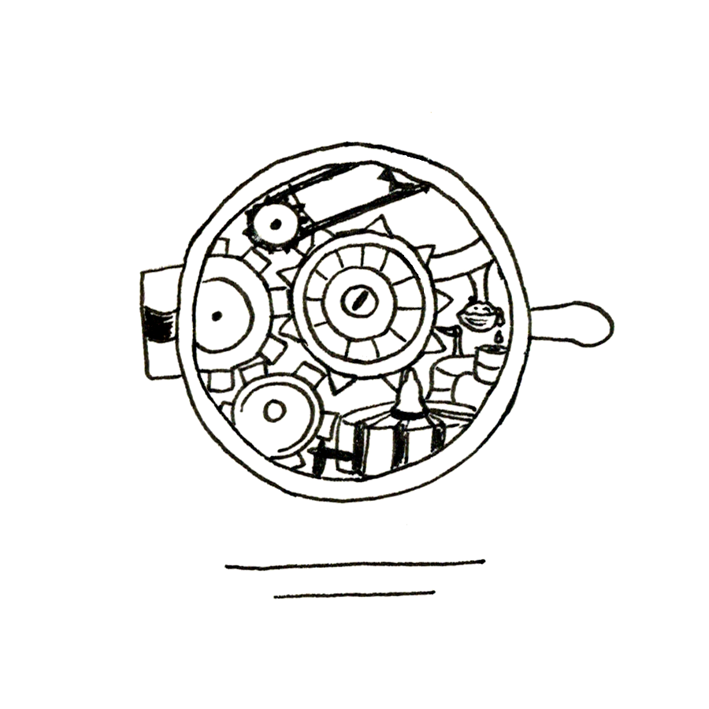

Courir, courir, c’est tout. Courir vers où ? Courir vers quoi ? S’enfuir... non. Comprendre. Le silence de la nuit, les bruits de ses pas. Kheira se concentrait sur eux. Fermer les yeux et courir. Les pensées fusaient, se bousculaient.

Tac... tac... tac... tac... les bruits de sa propre course comme une horloge résonnaient en elle.

Poppom... Poppom... poppom... Une musique se créait avec les battements de son cœur.

Han... han... han... han... sa respiration, dernier instrument venait compléter cette symphonie.

C’était le souffle, la vie, ce qui la composait, la mécanique de son corps. Se concentrer pour ne pas y penser. Se concentrer : ce cœur qui bat, ses pas qui battent et ce souffle qui bat. Se battre.

Crier.

Haaaaaaaaaaaaaa !

Un cri qui déchira le voile de la nuit. Un cri qui déchira le silence. Un cri qui perturba l’ensemble du paisible village et pourtant ce point d’orgue d’une violence inouïe, ce tourbillon de sentiment impossible à retenir qui sortit de la gorge de Kheira pour s’arracher à elle, prendre forme devant elle s’évanouit dans le présent comme il était apparu laissant la jeune fille s’effondrer sur le pas de la porte de son oncle et sa tante.

Elle pleurait. De longs sanglots sortaient désormais de sa gorge impossible à calmer. Pourtant, malgré les émotions folles qui s’entremêlaient à cet instant, le temps semblait être comme suspendu. Pourquoi des pleurs ? Kheira bouillonnait de colère, mais elle pleurait. Que signifiaient ces larmes ? Cette eau qui coulait sur sa joue n’était pourtant pas due à une révolte intérieure. Non, à ce moment-là, les pleurs comme de longs violons venaient remplacer le bruit des pas dans la symphonie qui se déroulait en elle. Trop de sentiments la submergeaient et tout se liquéfiait littéralement dans ses sanglots.

Colère, tristesse, culpabilité, frayeur, révolte prenaient vie dans ses larmes. Et en prenant forme ainsi, ils s’évanouissaient pour ne laisser place qu’à une seule pensée : Tom.

Il fallait... non, il ne fallait pas. Tom avait dit que ça irait. Tom avait dit que ça irait, Tom avait dit que ça irait. Une nouvelle musique, une nouvelle litanie envahit son cerveau. Kheira se surprit à dire ces mots à voix haute. Comme une incantation, elle se calmait petit à petit en les prononçant. Et elle commença à se concentrer sur elle-même afin de reprendre ses esprits.

*C’est extraordinaire le corps humain. Un coup de sang et il s’accélère comme une machine qui surchauffe. Et toutes les mécaniques qui le composent s’emballent également. D’abord, il y a le cœur. Il s’emporte facilement le cœur. Il bat vite, résonne dans la poitrine et embarque dans sa danse furieuse la respiration de sa victime. La poitrine se met alors à se soulever au rythme de l’organe vital. Puis, c’est les gouttes qui perlent sur le front. C’est un sacré truc que la transpiration. Ça empêche en général de cacher son émoi aux personnes qui nous entourent. Et si le cœur et la respiration peuvent être aisément -- ou tout du moins possible -- de réguler afin de ne pas se dévoiler, la transpiration nous trahit quasi automatiquement. Ensuite, le corps réagit presque simultanément avec le cerveau. Les pensées qui bouillonnent font danser le corps. Les mains se tortillent, la personne ne peut plus rester en place. Bien sûr, cela dépend de l’émotion ressentie alors et plusieurs cas de figure ont été observés. Mais tout de même, ça se vérifie de manière empirique assez régulièrement. Oui, décidément... c’est extraordinaire le corps humain.*

Kheira se leva difficilement, la main tenant encore fermement la clinche de la porte de la maison de son oncle et de sa tante. Elle souffla une dernière fois comme pour évacuer ce déferlement d’émotions. Ne lui restait alors qu’une boule au ventre, un nœud composé de trois fils inextricables : la colère, la culpabilité et la peur. Et au centre de ces trois sentiments, il y avait Tom.

Pourquoi avait-elle accepté de partir ? Pourquoi avait-elle accepté de le laisser ? Elle ne le savait pas.

Elle ferma les yeux comme pour effacer ce souvenir de sa tête et entra enfin en faisant un grand pas décidé dans cette vieille maison qu’elle avait toujours connue.

Changement d’ambiance et de décor. Dès qu’elle posa les pieds sur le plancher grinçant, la pression retomba. Elle était en sécurité. Elle était chez elle. Elle regarda autour d’elle : peu d’endroits lui permettaient de reposer ses yeux. Les esprits bouillonnants de son oncle et de sa tante ne leur permettaient pas de laisser de la place aux besoins triviaux que sont le ménage et le rangement. Des horloges de toutes sortes décoraient le mur central. Leurs cliquetis incessants garantissaient un calme tout relatif à Kheira.

Elle chancela, sentant ses forces l’abandonner. Sa course l’avait épuisée et dans ce cocon de souvenirs, elle se laissa aller quelques instants. Elle se glissa dans la pièce, faisant attention à ne rien faire tomber sous peine de réveiller le couple. Sur le sol, jonchaient des rouages de toutes tailles, des bouts de bois, des outils, des mécanismes anciens, Kheira devait marcher sur des œufs pour atteindre son objectif.

Enfin, elle arriva à sa destination et se laissa tomber lourdement dans un petit fauteuil.

*Oui, le corps humain est une extraordinaire mécanique. Il se répare la plupart du temps seul après une surchauffe et revient à son état normal rapidement. Malheureusement, cette merveille de technologie naturelle est tout de même plus difficile à appréhender qu’une horloge ou que quelques mécanismes que ce soit. Qu’il serait plus aisé d’aller dans un atelier et de regarder plus en détail comment se compose le corps ! De pouvoir jeter une pièce défectueuse et la changer, de remettre du sang dedans comme on mettrait de l’huile dans les lampes ! Que sais-je encore ! Mais je divague... pardonnez-moi... Peut-être un jour...*

Kheira se remémora ce début de nuit : l’accident... Tom, vidé de son énergie... elle, ne sachant quoi faire, déboussolée. Elle se pencha en avant, poussa un long râle et passa sa main dans ses longs cheveux noirs. Puis elle se leva d’une trombe. Il fallait qu’elle se calme complètement. La peur complètement dissipée, c’étaient des excès de rage et de culpabilité qui la prenaient à la gorge.

Comment allait-il ? Tom s’était effondré devant elle. Elle aurait dû rester. Elle le sait au fond d’elle. Mais il ne le voulait pas. Hé bien quoi ! Elle, d’un naturel si farouche, elle obéirait aussi facilement ? Elle allait y retourner. Retourner dans la nuit noire et trouver une solution. Elle se dirigea d’un pas décidé vers la porte d’entrée, avança sa main pour l’ouvrir, hésita quelques instants et... s’arrêta. Elle retira avec hâte sa main, comme si elle s’était brûlée, et porta son pouce à sa bouche. Elle fit claquer ses ongles sur ses dents, comme elle avait l’habitude de le faire lorsqu’elle était indécise. Elle tourna les talons et se retrouva à nouveau face au mur aux horloges. Elle ferma les yeux, fit non de la tête et retourna s’asseoir.

De toute façon, elle ne pouvait rien faire. Tom lui avait dit qu’il la recontacterait lorsqu’il irait mieux. Elle n’avait plus qu’à attendre. Mais, l’attente n’était pas son fort. Et puis...

Non, décidément, il lui était impossible de rester en place. Kheira en vint même à regretter que sa tante ou son oncle ne soit réveillé pour lui tenir compagnie. Elle ne pouvait pas y retourner. Elle le savait maintenant. Mais, elle ne pouvait pas non plus rester sans rien faire. Elle se leva à nouveau et, cette fois-ci, se dirigea vers l’escalier qui menait à l’étage inférieur : vers son cocon, son antre, son refuge, son atelier.

Fébrilement, elle traversa à la hâte la pièce, marchant d’un pas peu assuré et retenant sa respiration. Elle descendit les marches lentement, doucement, se crispant au son du grincement du bois. Enfin, elle arriva devant la porte de son atelier. Elle l’ouvrit avec délicatesse et entra. Elle referma avec hâte, s’adossa à la porte et souffla en fermant les yeux.

Lorsqu’elle les ouvrit à nouveau, elle esquissa un sourire en voyant le désordre qui régnait dans son espace de travail. Elle se dirigea vers son bureau et s’assit. Elle rit mélancoliquement. Elle avança sa main lentement vers le petit oiseau mécanique, le premier objet qu’elle avait fabriqué avec l’aide de son oncle. De facture simpliste, il suffisait de tourner une clé et ses ailes se déployaient et battaient frénétiquement. Mais, l’oiseau n’avançait pas. L’oiseau ne volait pas.

*Je... veux... voler. Je veux voler. Je veux m’enfuir. Je veux voir le monde, découvrir. Je veux respirer. J’étouffe ici. Je veux pouvoir manger, boire, sentir, toucher, crier un autre monde, un autre univers. Je veux explorer, voyager, rencontrer, être déçue, décevoir, VIVRE ! Je n’en peux plus de cette prison. Je n’en peux plus de ces barreaux. Je suis enchaînée. Je veux me déchaîner. Et si je dois mourir pour vivre, j’en accepte volontiers le prix. Ici, je ne fais que survivre pour ne pas mourir. Je suis dans une cage thoracique, un cœur prêt à exploser que l’on force à rester sage. Et mon cœur crie : je veux partir d’ici !*

*Mais avant cela, je dois...*

*C’est extraordinaire l’esprit humain. Il n’obéit à aucune logique et à aucune règle mécanique. Désormais, je le sais.*

Kheira écrasa l’oiseau mécanique entre ses mains et le jeta. Elle attrapa ensuite ses outils, l’esprit à la fois bouillonnant et apaisé par cette épiphanie. Elle se mit fébrilement au travail. Le contact des engrenages et rouages lui permettait de se recentrer. Un mot désormais envahissait son esprit : vengeance.