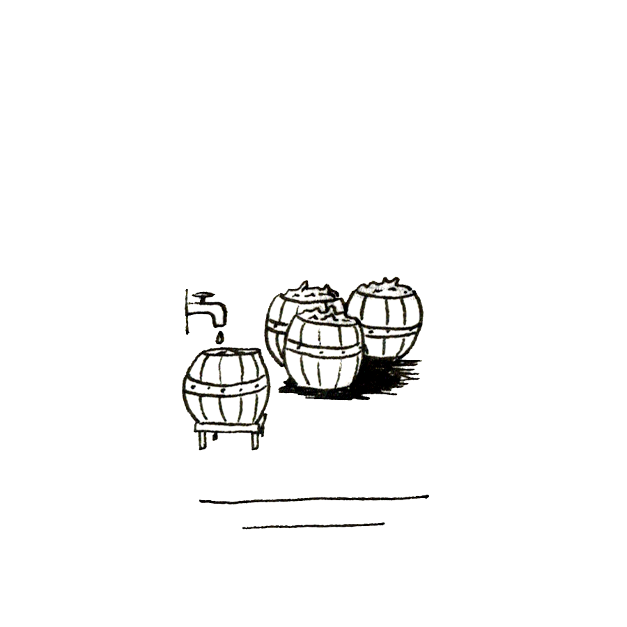

Je sors du bâtiment.

Les mots de mon oncle résonnent encore en moi, tandis que je respire à pleins poumons l’air frais du petit matin : « Déception... et si ta mère... il en découle de ta responsabilité... place au sein du village... pas convenable pour une jeune fille... et tes espoirs d’être acceptée par le cercle... et moi dans tout ça... »

Échos désagréables qui s’évaporent dans la douce lumière qui nimbe le village. Comme un sentiment de renaissance, qui efface la dure nuit passée dans le noir et l’humidité.

J’ai beau être sa nièce, mon oncle n’a rien fait pour adoucir ma sentence : un gardien de prison exemplaire !

S’il croit que ses grandes phrases vont me dissuader... cette Machine, je finirai bien par y accéder ! La voir constamment, de tous les points du village, de la fenêtre de ma chambre ; entendre son ronronnement de jour comme de nuit qui envahit mon esprit en permanence ; et ces techniciens qui se pavanent, comme si entretenir la Machine était la tâche la plus importante du village et eux au-dessus de tous...

Oui, bon, peut-être.

Les villageois commencent à sortir de chez eux, j’aperçois Babette qui ouvre la boulangerie, plus loin Lizzie et Maëg, jamais l’un sans l’autre. Eux ne se soucient pas de tout ça... seule la sécurité leur suffit. La Machine est une présence bienveillante, rassurante. « N’approchez pas de la Machine » et ils ne s’approchent pas de la machine. « Ne sortez pas du village » et l’extérieur n’existe plus. Mais comment peuvent-ils vivre ainsi, aveuglément, sans jamais se poser de questions ? Et si ces Arcanis n’étaient pas les sauveurs que tout le monde voit en eux ? Et si cet air vicié qui nous enferme et nous confine ne l’était pas tant que ça ?

Enfin, ce matin, pas question de me perdre dans ces réflexions ! De toute façon, en dix-huit ans, je commence à en avoir fait le tour... non, ce matin, l’espoir surgit, le bonheur renaît, la vie a de nouveau un sens : j’ai rendez-vous avec Tom !

Enfin... j’ai surtout un *plan* avec Tom.

Il semble que nous ne soyons que deux dans tout le village à se poser des questions, et s’intéresser à la machine... étrange que nous ayons mis tant de temps à nous rencontrer.

En cela, je suis reconnaissante à mon oncle : il aura fallu que je passe par la prison pour rencontrer Tom et commencer à entrevoir une solution.

Quoi qu’il en soit, bientôt, bientôt, je vais pouvoir étudier mémère de plus près ! Quelques détails à régler, deux ou trois choses à débusquer, si au passage je peux apprendre d’où vient Tom et pourquoi il se terre ainsi depuis tant d’années... je serai la plus heureuse des délinquantes !

-- Tiens, putrescente guenille ! Contente de voir que tu ne m’as pas oubliée !

-- Gente demoiselle au doux langage, comment l’aurais-je pu ? Je me réjouis de vous admirer à la lumière de la liberté !

-- Ouais, ouais, alors, quand passe-t-on à l’attaque ? Tu as pu repérer les tours de garde ?

-- Hum... et si nous en discutions dans un lieu plus sûr ? Non que la prison ne me paraisse le lieu le plus agréable du village, mais si je pouvais profiter de quelques heures de permission avant de me faire dénoncer par une de ces commères aux aguets...

-- Un lieu sûr, sans commères aux alentours, ici ? Laisse-moi réfléchir...

-- Chez moi ?

-- Chez toi ?

-- Chez moi, oui.

-- Parce que... tu as un chez-toi ?

-- Eh bien, si je te le propose...

-- Il a un chez-lui ! Ça alors, le criminel ténébreux et solitaire a un chez-lui !

-- Euh... Kheira, on peut y aller maintenant ?

-- Le vagabond taciturne, l’ermite misanthrope, l’énigmatique reclus, un chez-lui !

-- Kheira ?

-- Le mystérieux étranger, l’impénétrable inconnu, le nébuleux...

-- Kheira !

-- Ça va, ça va, allons-y.

J’emboîte le pas à Tom. Il traverse la place, décidé, contourne le puits, esquive un seau qui, renversé, se répand à terre, se faufile dans le cortège de ménagères partageant les derniers potins en attendant leur tour de puiser l’eau. Leurs caquètements se mélangent au cliquetis des engrenages alentour, emplissant la place du vacarme quotidien au village.

Pas un seul moment il ne lève la tête : les yeux rivés sur le sol, les épaules basses, les mouvements vifs et contenus, il n’attire pas l’attention. Passe inaperçu. Ne vérifie pas même si je le suis.

C’est pourtant ce que je fais, de toute l’agilité dont je suis capable. Mon regard rivé à son dos, j’analyse sa démarche. Renfermé, le garçon, et plutôt fuyant... criminel en déroute ? Morne adolescent délaissé ? Sombre génie incompris ?

Qui de lui ou de cette satanée machine m’intrigue le plus, difficile d’en décider ? Mais l’un comme l’autre, je finirai bien par percer tous ces mystères.

Eh ! mon oncle ne m’a pas couronnée du titre de la plus impertinente inquisitrice qui soit pour rien. Fichtre !

Il prend à gauche, avale une ruelle nauséabonde à grandes enjambées, escalade un muret, traverse une petite cour obscure, dévale quelques marches, se faufile entre deux cabanons biscornus...

-- Tom !

-- Hum, oui, Kheira ?

-- Juste comme ça : et si tu arrêtais de courir et marchais à mes côtés ?

-- À tes côtés ? L’invitation est tentante...

-- Oui, que je te cuisine un peu. Pourquoi être sorti du village hier ? Non que l’extérieur ne m’attire autant que toi, mais une raison précise ? Un besoin soudain de mourir asphyxié ?

-- Ah ! Kheira, vraiment, être à tes côtés me tente. Mais si tu t’obstines, je vais devoir te délaisser.

-- Essaie donc de me semer, tiens ! Je ne tiens pas à jouer la suivante énamourée, accrochée à chacun de tes pas !

-- Eh bien, ouvre la voie, je t’en prie. Direction nord-est !

-- Enfin, en voilà une bonne décision.

C’est donc d’un pas plus serein, et après de multiples tentatives d’investigation avortées que nous arrivâmes au « repaire de Tom ».

Et, messieurs, mesdames, quel repaire !

À l’orée du village, au fin fond du quartier le plus mal famé -- entendez vide et abandonné -- une maison délaissée, en ruine. Fumet putride et bâtiments défoncés aux alentours.

Voilà pour le décor.

Montez maintenant d’un étage, comme vous le pouvez. Personnellement, j’ai dû revoir ma technique de marelle et sautiller gaiement entre les trous et les planches moisies, tout en esquivant les poutres jaillissant d’endroits incongrus, pour parvenir, essoufflée, mais en sécurité, sur le pallier.

Tom pousse la porte -- la pousse, littéralement. Pas de serrure ou d’engrenage sécurisé ici, que nenni. 

Tom pousse la porte, donc.

Quatre murs. À quelques trous près.

Un matelas, étonnamment propre.

Une table basse, des étagères, quelques caisses en bois.

Et sur chacune de ces surfaces, en vrac, entassées sans aucune attention particulière, des dizaines, des centaines de machines.

Pas LA Machine, non, mais toutes ces petites machines que le village produit, tous ces engrenages assemblés habilement afin d’en tirer d’intéressants accessoires.

Au détail près que je n’en reconnais aucun.

Détail, dis-je, mais finalement vraiment pas. Ces machines, ces engrenages, sont ma passion. Je les ai tous étudiés depuis petite. Tous. Chacune des inventions réalisées dans ce village. Démontées, analysées, remontées. Améliorées, souvent.

De l’extracteur de noyau de pêche au vilebrequin à trois branches, en passant par l’incandescium.

Mais celles-ci, celles qui jonchent le sol de Tom, et recouvrent ses murs, je ne les connais pas.

Sacré choc, hein ? En tout cas, c’est sûrement ce qui vient de m’arriver, puisque Tom semble me parler depuis une bonne minute sans que je m’en sois aperçu.

-- Donc, le mieux serait d’agir ce soir. À la faveur de la nuit, on passera plus inaperçus. Frod est de garde toute la journée, mais Janis et Elane doivent le remplacer à la cinquième cloche.

-- Tom, t’es qui ?

-- Pardon ?

-- C’est quoi, tout ça ? Tu viens d’où ? Pourquoi personne ne te connaît au village ?

-- OK ! Il y a un problème, Kheira ?

-- Oui. Je déteste ne pas comprendre, je déteste ne pas savoir. Et là, y’a trop d’inconnues. Donc tu vas m’expliquer.

-- Hum, et si on revenait au plan ? Pour ce soir, le timing est serré. Il faut encore qu’on réfléchisse à un moyen de forcer le bâtiment, sans se faire repérer, et de rassembler les outils nécessaires pour...

-- C’est quoi ça ? Je n’ai jamais vu un tel assemblage, à quoi ça sert ? Et l’utilisation de cette vis, sur le côté, là ? Je n’y aurais jamais pensé ! Comment ça peut tenir ?

-- Une égraline. Pratique pour traiter les essences naturelles. La vis est de mon invention. En ce qui concerne la tour, je pense que j’ai une idée, mais pour ce qui est du périmètre de sécurité, là je pense plutôt qu’il faudrait...

-- Et ce truc ? Quel drôle de matériau... brillant comme le métal, souple comme le cuir, froid comme de la glace ! Je me demande à quel point c’est résistant.

-- Plus résistant que le meilleur alliage connu. Donc, comme je te disais, pour le périmètre de sécurité, ça serait plutôt de ton ressort. Si tu parviens à récupérer les plans dans le bureau de ton oncle, peut-être qu’on pourrait désactiver les mécanismes et...

-- Qu’est-ce que c’est lourd ! Si petit pourtant... combien il y a d’engrenages là-dedans, sept, huit ? Mon Dieu, même Ghil n’a jamais conçu quelque chose d’aussi complexe... et c’est le meilleur d’entre nous !

-- Plus d’une quinzaine en fait. Kheira, est-ce que tu m’écoutes ?

-- Hum... non, pas vraiment. C’est fascinant Tom, pourquoi tu ne m’as jamais montré tout ça ? Tu le sais pourtant, que ça me fascine !

-- Euh... parce qu’on s’est rencontré hier ? Bon, écoute, et si on se détendait un peu ? Tu as beau être charmante, tu m’empêches de réfléchir ! Tiens, attrape !

-- Je note quand même que je suis charmante...

Je m’affale à ses côtés et Tom m’envoie une petite boule qui semble en verre. Cerclé dans un métal fin, gravé sur toute sa surface de caractères torsadés, l’habitacle est incrusté d’une perle mate, aux reflets irisés. Elle contient un liquide translucide, d’un bleu limpide.

-- Qu’est-ce donc ?

-- Un khô.

-- Un khô ?

-- Un khô.

-- Peux-tu développer, homme taciturne, ou c’est trop te demander ?

-- Seulement si, après ça, tu te tiens tranquille. J’ai besoin de me concentrer.

-- Me tenir tranquille ? Pas sûre que ça vaille bien le coup.

-- Tu ne le regretteras pas. Avale-le.

-- Tiens, je n’aurais pas imaginé l’utiliser comme ça.

-- Bon, est-ce que tu me fais confiance ?

-- Vaguement.

-- Alors, avale-le.

-- Ça roule.

Je me love sur le matelas et je gobe le khô.

Étrange comme, peu à peu, les sensations se transforment en moi. J’ai à la fois un sentiment accru de ce qui m’entoure, du contact du tissu sur ma peau, de la chaleur qui émane de Tom tout près, de l’intensité de la lumière qu’émet un petit cube ronronnant dans un coin de la pièce ; dans le même temps tout s’atténue et se mélange, nuage évanescent d’une conscience qui se délite. Les sons deviennent murmures et quelque part au fond de mon esprit résonne la voix de Tom : « Apaisée comme un chaton, douce Kheira, qui s’envole ».

La masure de Tom petit à petit se transforme ; les murs cèdent la place à une végétation dense, touffue, étouffante. Au vrombissement des machines se mêlent les cris et échos d’une faune abondante, vivante. Les visions se succèdent, insaisissables, fuyantes, mais colorées. Par touches laissent des traces, des impressions. Des lieux, étranges et inconnus, me traversent. Des endroits si lointains qu’ils semblent appartenir à un autre temps. Flux de souvenirs et d’irréels, flous messages d’un univers parallèle.

Je me laisse porter, absente à moi-même, parcourue de plus que je ne peux le concevoir.

Traces, troubles, frémissements, secousses, plaintes, caresses, tremblements d’un monde qui n’existe pas.

Les heures passent et me traversent. Tom à côté, seul ancrage d’une sphère oubliée.

C’est son sursaut qui me réveille. Aussitôt, mes sens reprennent leur service et le mugissement strident d’une alarme explose à mes oreilles. Désorientée, je bondis et vacille.

Il me rattrape, m’explique.

-- Alerte invasion. Rentre chez toi au plus vite, tu ne peux pas rester bloquée ici alors que ces « choses » vont débarquer d’un instant à l’autre. File.

-- Quelle heure est-il ? Qu’est-ce qu’il s’est passé ?

-- Minuit passé. Le khô. On se retrouve demain, je t’expliquerai. Et on mettra ce plan au point.

Et il me pousse vers la porte, le goujat.

Je rentre chez mon oncle. Tom m’expliquera demain, j’y compte bien. Me reste dans la bouche l’amertume des incompréhensions que je supporte si peu. Et la vague sensation que quelque part, on se fait bien flouer.