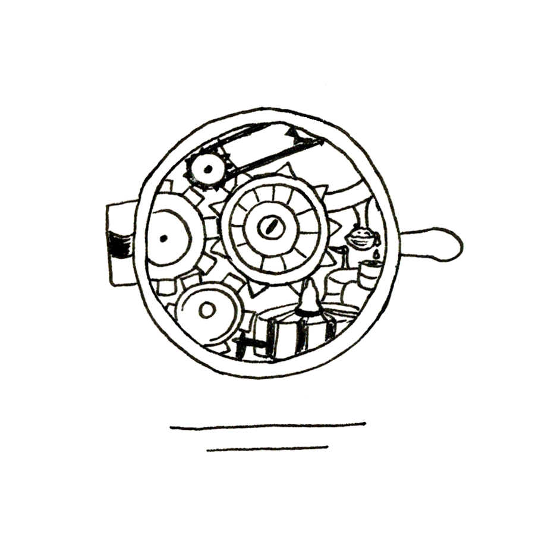

Alice observe la scène depuis le petit vasistas de la bibliothèque, juchée sur un escabeau qui lui sert à sortir de l’oubli les livres rares qui sont relégués sur la planche la plus haute de l’étagère et qui serait mangée par la crasse si elle ne la débarrassait pas, régulièrement, de ses toiles d’araignées et autres crottes de rats.

Alice est l’une des plus lettrées du village et elle a eu le privilège de se voir confier, par Gilbert, monsieur le maire en personne, une des clés de la bibliothèque. Elle s’y rend ainsi quand bon lui semble, en dehors des heures d’utilisation habituelles et s’est fait, de la petite salle, à la fois un refuge et une mine de connaissances qu’elle exploite sans s’en lasser. Elle lit, et relit, car les livres ne sont pas si nombreux, caresse la couverture des ouvrages anciens, certains datent de la nuit des temps et viennent de l’autre monde. La nuit des temps est difficile à dater précisément, mais représente plusieurs générations et est porteuse de mystère.

Alice fait des envieuses parmi les villageois, hommes comme femmes, qui aimeraient, comme elle, ne pas avoir charge de famille et évoluer à leur guise dans le village. Ils envient aussi sa fronde vis-à-vis des Arcanis : en effet, Alice cultive en secret un jardin potager derrière sa maison et fournit des légumes aux habitants qui le lui demandent, ce qui est formellement interdit. Seule la nourriture apportée par les Arcanis lors de leurs visites est autorisée, mais Alice la trouve aseptisée et fade et se régale des pots-au-feu qu’elle prépare elle-même en tuant de temps à autre un poulet élevé dans un enclos où il peut s’ébattre à son aise.

Pour l’instant, ce ne sont ni les livres ni la micro agriculture à laquelle elle s’adonne qui captivent Alice, mais le spectacle de désolation qui s’offre à elle. Au premier étage d’une des deux tours qui encadrent le grand bâtiment où sont entreposés les vivres fournis par les Arcanis, la bibliothèque offre une vue imprenable sur le village, minuscule agencement de maisons. Alice est lasse de le rappeler quand on lui fait remarquer qu’elle s’octroie des libertés, le territoire dans lequel elle évolue est un mouchoir de poche. Tout le monde sait qu’elle rêve d’un ailleurs plus vaste.

Le spectacle est désolant ce matin. La rue principale s’est transformée en bourbier. Par la fenêtre entrouverte lui parvient le bruit des bottes qui pataugent. Le sol est visqueux, les seaux d’eau remontés du puits et lancés sur le pavé ont du mal à faire place nette. Alice aperçoit Bernett qui s’affaire aux côtés de son homme. Le parvis de la minuscule mairie n’est pas épargné. Bob et Job ramassent les cadavres d’animaux. Ce sont toujours les jumeaux qui s’y collent. Dans leur brouette des bêtes impossibles à identifier. Même en se saisissant des petites jumelles fraîchement fabriquées dans l’atelier de précision, elle ne distingue qu’une masse de poils et de plumes. Sur le côté de la brouette pend une tête d’oiseau aux yeux vides et exorbités. Une corneille ? Un hibou ? Alice, bien qu’à distance, est écœurée. Elle ne s’accoutume pas à ces scènes de désolation. Elle y a déjà assisté pourtant, de trop nombreuses fois. Le désembouage des rues, l’incinération à la porte Nord du village des animaux morts pendant la nuit n’est pas un fait exceptionnel.

L’alarme a sonné pourtant, hier, alors que l’auberge était pleine à craquer pour la rituelle fête de l’automne. La petite fanfare venait de terminer son récital et sur la terrasse, la bière coulait à flots. Les gosses ramassaient des feuilles dorées dont ils faisaient des bouquets. Le hurlement déchirant de l’alarme a tout fait taire d’un coup : les jappements des chiens, les conversations bruyantes, les instruments. Le silence a été impressionnant quand l’alarme, elle aussi, a fini par se taire. Basile et Adrienne ont ouvert en grand les portes de l’auberge et quelques consommateurs se sont jetés à l’intérieur. Les autres sont rentrés précipitamment chez eux. Alice a raccompagné la vieille avec qui elle partage sa maison. Elle s’est assurée qu’elle et son petit-fils étaient en sécurité avant de se réfugier dans la bibliothèque. Le système de défense des Arcanis ferait son travail, voilà ce que tous ont pensé. Et, en effet, il a fonctionné. Les bêtes maléfiques fondant en bandes sur le village ont, une fois de plus, été repoussées. C’est pour cela qu’il a été installé, par les Arcanis en personne. Ils tiennent tellement à la substance délivrée quotidiennement par la Machine qu’ils ont tout intérêt à maintenir le village hors de portée des créatures flanquées exclusivement de mauvaises intentions et dont le pouvoir de nuisance est immense.

Sur la place, la boue colle encore aux semelles des villageois qui font ce qu’ils peuvent pour déblayer et rendre au lieu le charme qu’il avait hier.

Alice regarde toujours, peu culpabilisée de ne pas aider au nettoyage. Elle ne rajeunit pas et estime que la jeunesse du village peut se mobiliser plus efficacement qu’elle et sans en tirer de courbatures ensuite pendant des jours. Elle l’a assez fait, ne rechignant pas à mettre à disposition ses seaux, ses brosses et sa charrette. Elle connaît la consistance de la boue pour y avoir mis les mains, elle connaît la sensation collante qui reste sur la peau des jours et des nuits après, elle sait que les villageois chargés de la lessive auront beaucoup de peine à rendre au linge sa fraîcheur originelle et que beaucoup préféreront coudre et se rhabiller de neuf.

Le jour se lève à peine. Alice a peu dormi, allongée sur les quelques coussins qu’elle laisse là et sur lesquels elle s’installe pour lire. Elle s’est refusée à regarder par la fenêtre pendant la nuit, ayant peur malgré elle d’être emportée comme un vulgaire animal dans les griffes d’un de ces monstres, mille fois décrits et jamais vus, dont l’alarme était annonciatrice. Elle descend de l’escabeau, remet sur elle le châle épais hérité de son arrière-grand-mère et s’allonge comme elle peut. Son arrière-grand-mère l’a connu, elle, ce fameux autre monde et elle ne vivait pas dans une minuscule cité fortifiée. Son espace devait être infini. Le châle en est un symbole et Alice s’y blottit et ferme les yeux. La petite horloge de la bibliothèque indique six heures. Le tic-tac régulier la berce.

Des bruits de voix la font sursauter maintenant. Ce n’est plus le brouhaha des villageois réunis en bas, ce n’est plus Gilbert qui pérore en donnant ses instructions. Les Arcanis viennent de débarquer ! C’est leur heure. Ils sont matinaux, sans doute parce que la substance délivrée par la Machine est plus riche le matin.

Alice réajuste son châle et descend. Les Arcanis se doivent d’être accueillis par l’ensemble de la population. Ils sont là, tous les quatre alignés devant la mairie. Gilbert a troqué ses bottes contre des petits souliers. Il est Monsieur le Maire et les accueille avec considération. Sa chemise recouvre mal son ventre et ses traits sont tirés. D’un mouvement de tête extrêmement discret, il vient de désigner trois hommes à jeter au plus vite en prison, la visite des geôles fait partie de ce qu’affectionnent les Arcanis. Une prison vide pourrait faire mauvais effet.

Un petit groupe s’éclipse et prend le chemin de la maison d’arrêt. Celle-ci est minuscule, à l’échelle du village et ne peut accueillir que quatre prisonniers, répartis dans deux cellules. Alice y a déjà passé vingt-quatre heures dans sa jeunesse, alors qu’elle tentait de s’approcher de la Machine. Cette Machine qui purifiait l’air déclenchait dans son imaginaire d’enfant des fantasmes délirants. Elle imaginait un système un peu à l’image d’un orgue, fait de tubes dans lequel entrait et sortait l’air. Elle avait fait des ouvriers chargés de la maintenance des organistes. Mais prise en flagrant délit aux abords du bâtiment dans lequel était installée la Machine, elle avait passé une nuit à la fraîche, toutes grilles ouvertes.

La prison n’a pas changé depuis. Son fonctionnement tient plus du symbole que d’une quelconque autorité de la gouvernance du village.

Les Arcanis ont leur visage des mauvais jours. Ils prennent note des identités des personnes incarcérées, ils demandent des comptes sur le comportement de tout un chacun qui n’a pas réagi à l’alarme. Elle s’est pourtant bien déclenchée. Le système de défense a bien réagi. Mais les villageois, eux, sont restés passifs ! Pourquoi tant de boue, encore à cette heure-ci ? (Il est 6 h 37, indique l’engrenage de précision qu’Alice porte au poignet droit.) Les Arcanis ne mâchent pas leurs mots. Le plus petit des quatre est le plus tranchant.

-- Vous cuvez encore votre beuverie d’hier ! La fête de l’automne s’est vidée de son sens ! Les saisons ne veulent plus rien dire pour vous ! Ça sent encore la bière ici ! Aucun d’entre vous ne peut le nier ! Nous exigeons de voir les prisonniers. Cela nous donnera l’occasion de voir l’état des murs du pénitencier. Si leur décrépitude est à l’image de ce qui s’offre ici à nos yeux, il faudra prendre des mesures drastiques !

Alice n’apprécie pas le ton méprisant du personnage.

Gilbert et Bernett en tête, encadrés par deux Arcanis capés de gris, une cinquantaine de personnes se mettent en route vers la prison. Les deux autres Arcanis ferment le cortège et maintiennent sur le village un orage en formation pour ne rien relâcher de la pression.

Le terme de pénitencier est vraiment usurpé, rigole doucement Alice. La bâtisse dédiée est à peine plus grande qu’une maison particulière. Un gardien, arrivé en même temps que les prisonniers montent la garde devant l’entrée.

L’Arcanis qui vient de s’exprimer sur la place publique, d’un claquement de doigts, fait apparaître les deux hommes et la jeune femme incarcérés.

-- Quels sont les faits qui leur sont reprochés ?

Gilbert, qui est aussi le directeur de la prison, parle d’une perte de la notion de civisme.

-- Les gens se désintéressent de leur lieu de vie. Ils jettent leurs ordures dans les rues, ne respectent plus les anciens, n’ont plus le cœur à l’ouvrage. Malgré les instruments de mesure qu’eux-mêmes fabriquent, ils ne sont plus à l’heure, n’ont plus d’horaires, ne veulent plus de contraintes.

Les quatre Arcanis, de nouveau alignés, sont dubitatifs. Personne ne parle en dehors de Gilbert qui cherche ses mots.

-- Vous vous rendez compte de l’état du village ? Tous réunis dans la taverne à manger, boire et danser alors que l’alarme retentit et que vous savez pertinemment quel danger plane sur vous ! Quelle inconséquence ! Vous, Gilbert, que faisiez-vous hier soir ?

Le regard perçant de l’Arcanis traverse Gilbert alors qu’une gerbe d’éclairs illumine le ciel. Un long murmure parcourt l’assemblée.

-- Et vous ? Et vous ? Et vous ? Que faisiez-vous ? Tous autant que vous êtes ? Vous terrer et attendre, c’est tout ce que vous savez faire ? Mille maléfices plus malins que l’invasion d’hier vous menacent, auxquels vous n’êtes pas préparés.

-- Allons, calmons-nous, tente Gilbert dans un souci d’apaisement.

Les Arcanis tournent les talons sans l’écouter. Les prisonniers ne savent s’ils doivent rentrer en cellule ou rentrer chez eux. Ils balbutient des excuses alors que plus personne ne les écoute.

Les capes grises se dirigent vers la Machine, de l’autre côté du village. Les Arcanis scandent des formules tout en avançant. Le défilé a de quoi inquiéter. Alice est toujours là. Elle a fait une incursion dans la cellule du fond tout à l’heure pour se replonger dans l’ambiance de ses années rebelles, mais elle suit à présent tout le monde jusqu’à la Machine.

Lorsque l’ouvrier préposé à la vidange ouvre la cuve, l’exclamation est générale ! Elle est quasiment vide ! Une nappe d’à peine quelques centimètres, là où il y a habituellement de quoi remplir quatre fûts que les Arcanis se répartissent et avec lesquels ils repartent. Il y a ce matin à peine de quoi remplir une jarre. Un des ouvriers s’apprête à verser le liquide dans une des amphores qui sert habituellement à se désaltérer quand la température est trop élevée dans le bâtiment. Mais les Arcanis arrêtent son geste d’une formule qui le paralyse. Personne ne comprend la langue dans laquelle elle est énoncée, mais l’ouvrier, statufié, est sans réaction à présent. Les Arcanis arpentent le bâtiment en tous sens et à toute allure. On les voit aussi bien au sol qu’au plafond. L’air est électrique. Gilbert est déconcerté. C’est la première fois que la Machine ne produit rien. Bernett et lui sortent et Gilbert sent qu’il doit s’adresser à la population. C’est ce qu’on attend de lui. L’heure est grave. Les Arcanis sortent à leur tout du grand hangar. Leur couleur est devenue indéfinissable. Le blanc dont ils sont vêtus est éblouissant. Une lumière aveuglante inonde intégralement le territoire du village. Même le haut des murailles n’est plus visible. Le ciel et la terre se mêlent dans un capharnaüm invraisemblable. Des habitants s’évanouissent, les oiseaux décampent et se cognent contre les murs devenus invisibles, mais bien en place encore, les bêtes s’affolent. Mais surtout, et c’est ce qui décide Gilbert à monter sur l’estrade officielle et à réclamer un peu de calme, surtout, toutes en même temps, les horloges se dérèglent. Il est sept heures à la mairie, midi dix à l’église, trois heures moins vingt au poignet de Gilbert et les aiguilles de la montre d’Alice viennent de tomber sur le sol avec un infime bruit métallique. Elle les ramasse précautionneusement, tandis que Gilbert, après avoir toussoté, et, sans savoir à quoi il s’engage vis a vis des Arcanis, prononce cette phrase :

-- On va voir ce qu’on peut faire.

Dans un souffle orageux, les Arcanis disparaissent laissant le village comme un champ de bataille.
